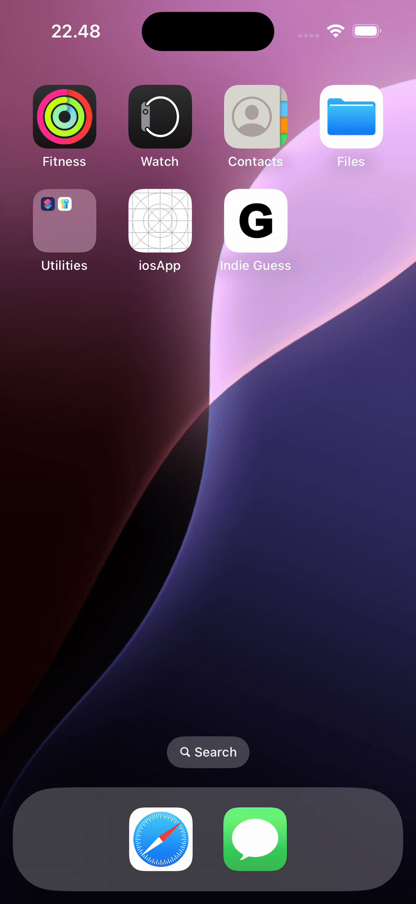

# 🎯 indieGuess

**indieGuess** is a minimalist number-based puzzle game for iOS inspired by classic logic games like Mastermind. Your goal is to guess a hidden number by making informed attempts and analyzing feedback:  
🟢 **Correct digit and position**  
🟡 **Correct digit but wrong position**


[](https://apps.apple.com/fi/app/indie-guess/id6747625169)

> Built with ❤️ using Swift and SwiftUI. Fully open-source.

---

## 📲 Gameplay

Each round, a secret number is generated. You have a limited number of guesses to figure it out.

After each guess, you receive feedback:
- ✅ **Matches**: Digits that are correct and in the right place.
- 🔄 **Wrong matches**: Digits that are part of the number but placed incorrectly.

Example:
```
Secret: 580230
Guess:  000230
Result: 2 matches, 1 wrong match
```

---

## 📸 Demo

<p float="left">
  
</p>

---

## 🛠 Features

- ✅ Clean, modern SwiftUI interface
- ♿️ Full VoiceOver accessibility support
- 🌙 Dark mode ready
- 🧪 Unit-tested matching algorithm
- 🚫 No tracking, no ads, fully offline
- 📦 Open-source under MIT license

---

## 🚀 Getting Started

### Requirements

- Xcode 16 or later
- iOS 18 or later

### Clone & Run

```bash
git clone https://github.com/fgadea/indieGuess.git
cd indieGuess
open indieGuess.xcodeproj
```

Then run the app in the simulator or your device!

---

## 💡 Contributing

Found a bug? Have a feature idea? Feel free to open an issue or submit a pull request!

### To Do

- [ ] Game center integration
- [ ] Leaderboards or statistics
- [ ] Settings screen (theme, customization)

---

## 📄 License

This project is licensed under the GPL-3.0 License — see the [LICENSE](LICENSE) file for details.

---

## 👤 Author

Made with care by [Felipe Gadea Llopis](https://github.com/fgadea)  
You can also find me on [LinkedIn](https://www.linkedin.com/in/felipe-gadea-llopis/)

---

## 🙌 Acknowledgements

Thanks to everyone who supports indie development and open-source software ❤️
